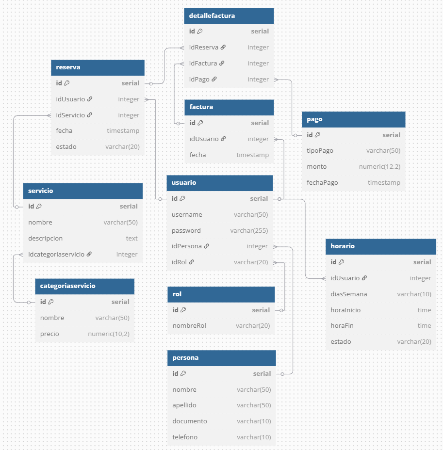

# 📱 Golden Barbershop - Documentación General de la Aplicación

## 🧾 Descripción General

**Golden Barbershop** es una aplicación móvil desarrollada para mejorar la experiencia de los clientes y la gestión administrativa de una barbería. El proyecto se construyó bajo una **arquitectura monolítica**, utilizando **Angular + Ionic** para el frontend, y **Java con Swagger** para el backend. Se implementó bajo la metodología ágil **Scrum**, con entregas incrementales y trabajo colaborativo entre los miembros del equipo.

---

## 🗂 Metodología Ágil: Scrum

Se empleó la metodología Scrum para la organización del trabajo. El equipo creó un **Product Backlog** inicial con 8 **Historias de Usuario (HU)**, que fueron desarrolladas en sprints sucesivos.

### 📝 Backlog de Historias de Usuario

| Nº  | Historia de Usuario                           | Descripción breve                                        |
|-----|-----------------------------------------------|----------------------------------------------------------|
| 01  | Entendimiento del Negocio                     | Análisis de las necesidades y procesos del negocio       |
| 02  | UI/UX                                         | Diseño centrado en el usuario para una experiencia fluida|
| 03  | Registro de Usuario                           | Permitir el registro de nuevos usuarios                  |
| 04  | Login y vistas                                | Autenticación de usuarios                                |
| 05  | Administrar Servicios                         | Gestión de servicios y tarifas desde el panel admin      |
| 06  | Agendar Cita                                  | Selección de fecha, hora y servicio para agendar citas   |
| 07  | Cancelar Cita                                 | Cancelación de citas previamente agendadas               |
| 08  | Registrar Pago                                | Registrar el pago asociado a una cita completada         |

### 🧩 Detalle de Historias de Usuario

- **01-HU Entendimiento del Negocio**  
  Se hizo una reunión con los stakeholders para conocer los procesos actuales, identificar necesidades y objetivos.

- **02-HU UI/UX**  
  Se trabajó en el diseño de interfaces enfocadas en el usuario final, utilizando prototipos de baja y alta fidelidad antes del desarrollo.

- **03-HU Registro de Usuario**  
  Los nuevos usuarios pueden registrarse ingresando nombre, correo y contraseña.

- **04-HU Login**  
  Implementación del sistema de autenticación para acceder a las funcionalidades de la app.

- **05-HU Administrar Servicios**  
  El administrador puede gestionar los servicios ofrecidos por la barbería (crear, editar, eliminar, asignar precios).

- **06-HU Agendar Cita**  
  Los usuarios pueden seleccionar un servicio y una fecha disponible para agendar su cita.

- **07-HU Cancelar Cita**  
  Funcionalidad para que el usuario cancele citas agendadas con anticipación.

- **08-HU Registrar Pago**  
  El administrador registra pagos una vez que el cliente recibe el servicio.

---

## 🎯 Requerimientos

### ✅ Requerimientos Funcionales

- Registro y autenticación de usuarios.
- Visualización y administración de servicios.
- Agendamiento y cancelación de citas.
- Registro de pagos por parte del administrador.
- Visualización de citas agendadas por usuario.

### ❌ Requerimientos No Funcionales

- Seguridad en la autenticación.
- Diseño responsive tipo aplicación móvil.
- Uso de contenedores Docker para facilitar el despliegue.
- Generación de APK desde Android Studio.

---

## 🏛 Arquitectura

El proyecto se desarrolló usando una **arquitectura monolítica**:

Frontend (Angular + Ionic)
            ↓
Backend (Java + Swagger)
            ↓
Base de Datos (postgresSQL)

El backend expone endpoints documentados mediante **Swagger**, y el frontend consume dichos endpoints a través de servicios HTTP. Todo el sistema se ejecuta en contenedores Docker, facilitando la instalación y pruebas.

---

## 🧱 Diagrama UML de Casos de Uso:

## Modelo DB

## Diagrama MR

# MANUAL DE USUARIO